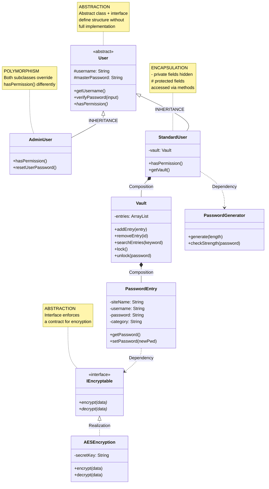

# Java Password Manager

A Java desktop application for securely storing and managing passwords, built as a final project for Spring 2026.

## Features

- User authentication (Login / Sign Up with security PIN)
- Encrypted password vault per user (AES encryption)
- Add, view, modify, and remove saved credentials
- Built-in password generator
- Admin user role with elevated permissions (e.g., reset user passwords)

## UI Screens

| Screen | Description |
|---|---|
| Log In | Authenticate with username and master password |
| Sign Up | Create account with username, master password, and security PIN |
| Password Manager (main) | Table view of all saved entries; access all actions from here |
| Add Password | Save a new site/username/password entry |
| Generate Password | Auto-generate a password for a site |
| Modify Password | Update the password for an existing entry |
| Remove Password | Delete an existing entry after confirming current password |
| View Password | Reveal a stored password after entering security PIN |

## Architecture

The project demonstrates the four pillars of OOP:

- **Abstraction** — `User` abstract class and `IEncryptable` interface define structure without full implementation
- **Encapsulation** — private/protected fields accessed only through methods
- **Inheritance** — `AdminUser` and `StandardUser` both extend `User`
- **Polymorphism** — both subclasses override `hasPermission()` differently

### Class Diagram

## Tech Stack

| Layer | Technology |
|---|---|
| Language | Java 17+ |
| UI | Java Swing / AWT |
| Database | SQLite (via `sqlite-jdbc` — xerial) |
| Encryption | AES (custom `AESEncryption` class implementing `IEncryptable`) |

> Passwords are encrypted via `AESEncryption` before being written to the database — the SQLite file itself is not relied upon for security.

